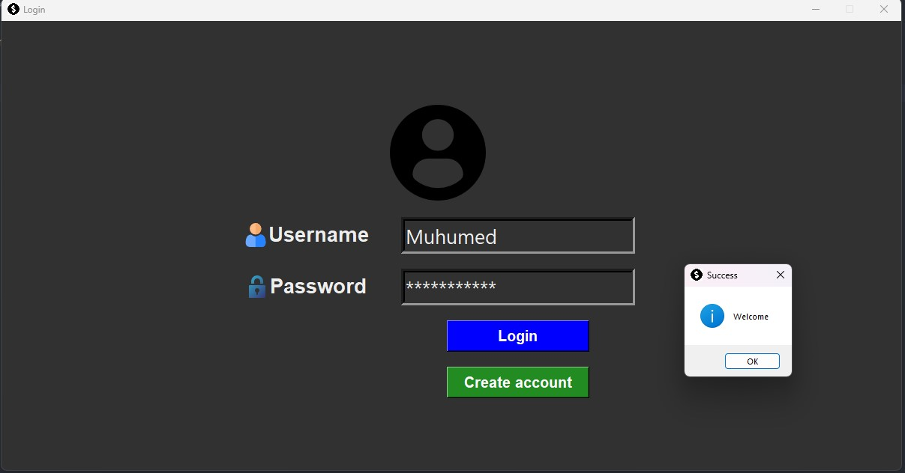
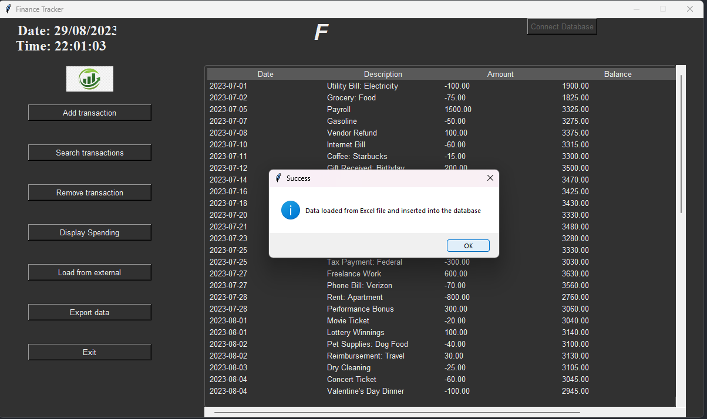
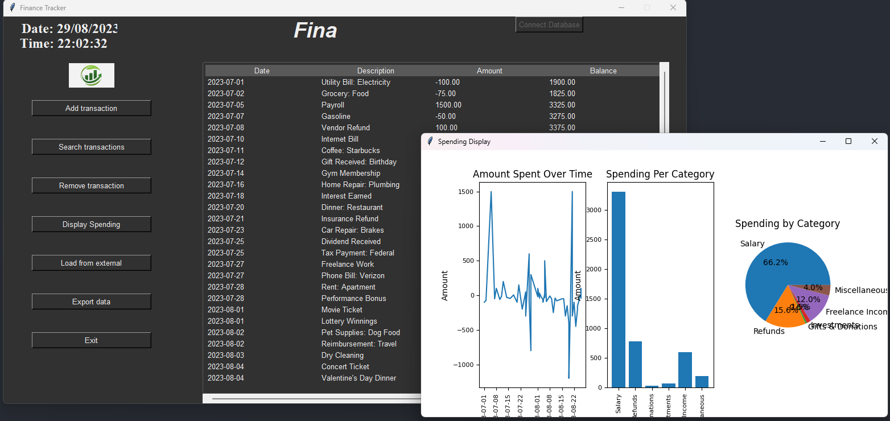
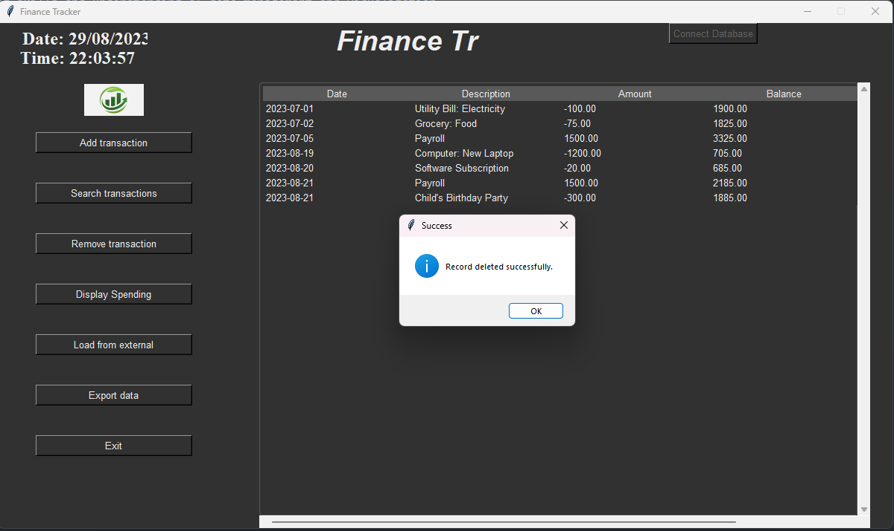
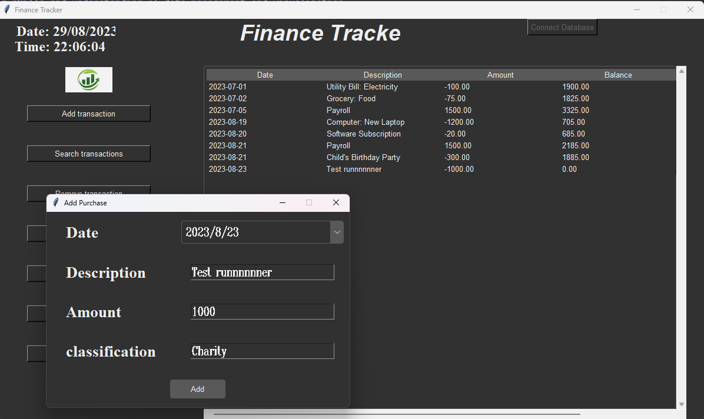
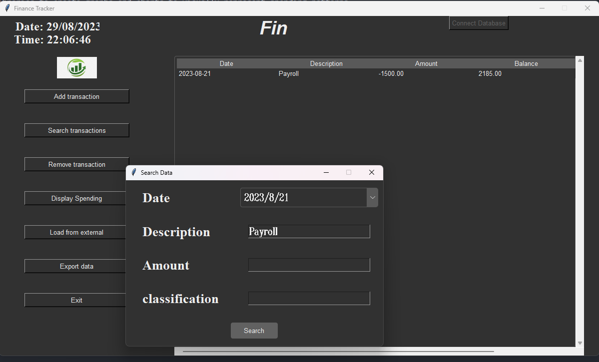

# FinanceApp

• Developed a Finance Tracking App using Python to manage personal expenses and budgets

• Implemented features to track income, expenses, and savings, allowing users to gain insights into their financial
habits

• Utilized data visualization libraries to create graphs and charts to visually represent spending patterns

• Strengthened Python programming skills and understanding of data management and visualization

